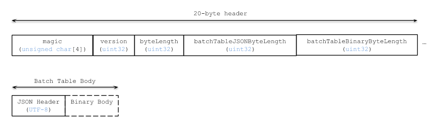

# 3DTILES_external_batchtable Extension

## Overview

The standard batch table embeds all feature properties in either its JSON header or in the optional binary body. However, some datasets have a large number of properties, and all properties are not necessarily needed in all applications. This extension allows some or all properties to be made available to 3D Tiles clients as separate files, rather than embedded in the tiles themselves.

## Motivation

TODO: Maybe use https://github.com/opengeospatial/3D-Data-Container-Tile-API-Pilot/issues/5#issuecomment-582339601 as a starting point.

## Batch table JSON schema updates

The standard batch table may be extended to include a `3DTILES_external_batchtable` object that references an external batch table.

Sample batch table:

```json
{
    "extensions": {
        "3DTILES_external_batchtable": {
            "external": [
                {
                    "properties": ["heatingDemand", "roofDirection"],
                    "uri": "heating.btbl"
                },
                {
                    "properties": ["yearBuilt", "architect"],
                    "uri": "historical.btbl"
                }
            ]
        }
    }
}
```

`properties` lists the feature properties that are included in the external batch table, enabling clients to decide whether the external batch table is needed.

`uri` is the URI of the external batch table. It is resolved relative to the tile content file.

## External batch table structure

The structure of the external batch table file mirrors the [standard batch table](../../specification/TileFormats/BatchTable/README.md), with the addition of a file header section:



## Header

The 20-byte header contains the following fields:

|Field name|Data type|Description|
|----------|---------|-----------|
| `magic` | 4-byte ANSI string | `"btbl"`.  This can be used to identify the file as an External Batch Table. |
| `version` | `uint32` | The version of the External Batch Table format. It is currently `1`. |
| `byteLength` | `uint32` | The length of the entire file, including the header, in bytes. |
| `batchTableJSONByteLength` | `uint32` | The length of the Batch Table JSON section in bytes. |
| `batchTableBinaryByteLength` | `uint32` | The length of the Batch Table binary section in bytes. |

The `batchTableJSONByteLength` and `batchTableBinaryByteLength` properties are exactly as described in the [Batched 3D Model](../../specification/TileFormats/Batched3DModel/README.md), [Instanced 3D Model](../../specification/TileFormats/Instanced3DModel/README.md), and [Point Cloud](../../specification/TileFormats/PointCloud/README.md) specifications.

The body section immediately follows the header section, and is exactly as described in the [Batch Table](../../specification/TileFormats/BatchTable/README.md) specification.

